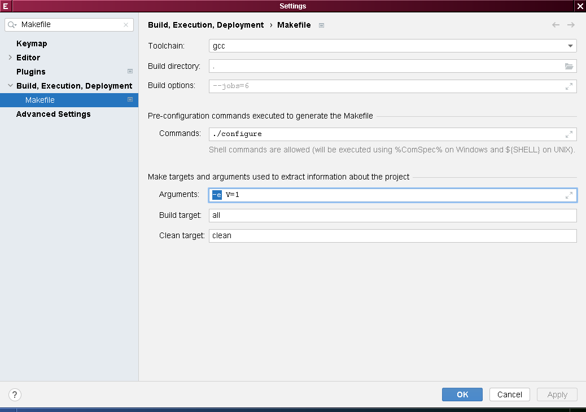

# Как работать с `Makefile`-проектами в среде _CLion_

## Содержание

 * [Постановка задачи](#постановка-задачи)
 * [Подходы к анализу проектной модели](#подходы-к-анализу-проектной-модели)
   * [База данных компиляции](#база-данных-компиляции)
   * [Переопределение переменных окружения](#переопределение-переменных-окружения)
     * [Переопределение переменной `$(MAKE)`](#переопределение-переменной-make)
     * [Переопределение компиляторов](#переопределение-компиляторов)
     * [Переопределение оболочки](#переопределение-оболочки)
   * [Перехват системных вызовов](#перехват-системных-вызовов)
   * [Запуск _Make_ в режиме "dry run"](#запуск-make-в-режиме-dry-run)
 * [Выделение списка целей](#выделение-списка-целей)
   * [_GNU Make_](#gnu-make)
   * [_BSD Make_](#bsd-make)
 * [Рекомендации](#рекомендации)

Если вам лень вникать в скучные технические детали, можете перейти прямо к
разделу "[Рекомендации](#рекомендации)".

## Постановка задачи

Основная проблема с проектами, использующими в качестве системы сборки _Make_,
состоит в том, что эта система сборки не предоставляет ровным счётом никакой
информации о проектной модели, т. е. о том, какие файлы исходного кода попадут
на вход компилятору, какие ключи компилятора, директивы препроцессора и
заголовочные файлы будут использованы, и какие бинарные файлы мы получим на
выходе. Эта информация остаётся неизвестной до тех пор, пока проект не будет
собран. В этом состоит сложность задачи интеграции сред разработки (IDE) и
системы сборки _Make_.

Рассмотрим, например, проект с вот такой плоской структурой:

 * `Makefile`
 * `foo.c`
 * `bar.c`

и вот таким элементарным `Makefile`:

```Makefile
.PHONY: all
all: foo

.PHONY: clean
clean:
	$(RM) foo
```

Здесь видно, что файл `foo.c` является частью проектной модели, т. к. будет
участвовать в процессе компиляции (посредством встроенного правила `$(CC) foo.c
-o foo`), а файл `bar.c` &mdash; не является.

## Подходы к анализу проектной модели

### База данных компиляции

Можно решить задачу "в лоб" и просто сначала собрать проект, а затем выяснить,
какие файлы и с какими флагами были скомпилированы. Для создания файла
`compile_commands.json` (собственно базы данных компиляции) будем использовать
любой из доступных генераторов &mdash;
[`bear`](https://github.com/rizsotto/Bear) или
[`compiledb`](https://github.com/nickdiego/compiledb). `bear` работает
посредством перехвата динамических вызовов (`LD_PRELOAD`) и потому выдаёт
достаточно точный результат, не зависит от системы сборки (т. е. может
использоваться совместно с любой системой сборки, хоть с чёртом в ступе, а не
только с _Make_), но имеет ограничения на _Mac OS X_ и вообще не работает на
_Windows_. С другой стороны, `compiledb` анализирует исключительно _вывод_
команды `make` и потому нередко совершает ошибки, но, с другой стороны,
работает везде. Если вы используете _Linux_, я предлагаю вам остановить свой
выбор именно на `bear`. По крайней мере, у вас не будет ошибок, связанных с
неверной интерпретацией двойных кавычек, апострофов и путей, содержащих пробелы.

Итак, мы собрали наш проект, "обернув" команду сборки и выполнив что-то вроде
`bear make` или `bear make all`, и теперь имеем на выходе заветный
`compile_commands.json`. _CLion_ вполне в состоянии открыть этот файл как
проект, но я вижу по меньшей мере 2 недостатка:

 1. Сборка всего проекта может занимать десятки минут (ядро _Linux_) или даже
    часы, а открыть проект в IDE хочется "почти мгновенно".

 1. Если вы не просто открыли проект с целью "посмотреть код", а собираетесь
    добавлять/удалять/переименовывать файлы, переписывать сам `Makefile` или
    его прототип (как в системах сборки типа [_GNU
    Autotools_](https://ru.wikipedia.org/wiki/Autotools), работающих поверх
    _Make_), то после каждой такой операции вам придётся заново генерировать
    базу данных компиляции. И это муторно, скажу я вам.

Поэтому стоит задаться вопросом, нет ли способа проанализировать структуру
проекта, не выполняя сборку.

### Переопределение переменных окружения

#### Переопределение переменной `$(MAKE)`

Этот подход не может использоваться как самостоятельное решение, однако, если
проект использует рекурсивные вызовы _Make_ (см. [5.7 Recursive Use of
`make`](https://www.gnu.org/software/make/manual/html_node/Recursion.html)),
можно переопределить переменную `MAKE` и, подставив в значение путь до
собственной обёртки над _Make_, отслеживать все такие вызовы и, при
необходимости, менять или дополнять флаги _Make_, редактируя аргументы
перехватываемой командной строки.

#### Переопределение компиляторов

Переопределяя переменные `CC` и `CXX`, можно перехватывать вызовы компилятора
и, таким образом, точно знать, в каком каталоге и с какими аргументами
компилятор был вызван.

#### Переопределение оболочки

Переопределяя переменную `SHELL`, можно получить информацию обо всех вызываемых
командах (а не только о командах компиляции).

Разумеется, вышеупомянутые техники можно произвольным образом комбинировать.

### Перехват системных вызовов

На _Linux_, _Solaris_ и, с оговорками, _Mac OS X_ информацию о системных
вызовах
[`execve()`](https://www.tutorialspoint.com/unix_system_calls/execve.htm) (и
интересующих нас аналогах) можно получить через механизм `LD_PRELOAD` или
(_Linux_) запуская утилиту
[`strace`](https://man7.org/linux/man-pages/man1/strace.1.html). Впрочем,
полученное решение уже не будет кроссплатформенным.

Я не знаю ни одного инструмента, где бы хотя бы частично были реализованы эти
техники, кроме, быть может, _NetBeans CND_ и _Oracle Solaris Studio_. Однако,
насколько мне известно, поддержка `Makefile`-проектов в упомянутых продуктах не
развивалась с 2016 года.

### Запуск _Make_ в режиме "dry run"

На русский язык переводится как "репетиция", но я ни разу не слышал, чтобы
использовался русскоязычный термин, поэтому впредь буду называть этот режим
именно "dry run", как в англоязычной документации. Вот описание ключа командной
строки _GNU Make_:

> **-n, --just-print, --dry-run, --recon**
>
> Print the commands that would be executed, but do not execute them
> (except in certain circumstances).

Помимо этого флага, нам ещё понадобится флаг `w`:

> **-w, --print-directory**
>
> Print  a message containing the working directory before and after
> other processing.  This may be useful  for  tracking  down  errors
> from complicated nests of recursive make commands.

и флаг `k`:

> **-k, --keep-going**
>
> Continue  as  much  as  possible after an error.  While the target
> that failed, and those that depend on it, cannot  be  remade,  the
> other dependencies of these targets can be processed all the same.

Полная командная строка, таким образом, будет `make -wnk`, и вывод команды
_Make_ в большинстве случаев позволяет нам проанализировать структуру проекта.
Этот способ не столь точен, как переопределение переменных или перехват
системных вызовов, но он относительно прост в реализации, и в _CLion_
используется именно этот подход.

Вручную указывать в настройках флаги `w`, `n` и `k` не нужно: в процессе
анализа проектной модели _CLion_ подставит их автоматически. При необходимости
флаги, используемые для анализа, можно изменить в расширенных настройках, но я
ни разу не видел проектов, где в этом была бы практическая необходимость:


## Выделение списка целей

### _GNU Make_

### _BSD Make_

## Рекомендации

Теперь, собственно, то, ради чего вся эта статья и была написана. Следование
этим рекомендациям не даст стопроцентной гарантии, что ваш проект без ошибок
откроется в _CLion_, но, во всяком случае, существенно снизит количество этих
ошибок.

 1. Убедитесь, что проект таки собирается (в том же окружении и тем же
    компилятором, какие выбраны в настройках проекта _CLion_). Условно говоря,
    если в настройках выбраны WSL и GCC, то код должен собираться в выбранной
    гостевой виртуальной машине компилятором GCC. Отсутствующие заголовочные
    файлы, недостающие зависимости, завершающийся с ошибкой сценарий
    `configure` (для _GNU Autotools_) &mdash; все эти проблемы стоит разрешить
    заранее, _до_ того, как вы попытаетесь открыть проект в _CLion_.

 1. Используйте [_GNU Make_](https://www.gnu.org/software/make/). Убедитесь,
    что путь именно к этому инструменту выбран у вас в настройках. [_POSIX
    Make_](https://pubs.opengroup.org/onlinepubs/9699919799/utilities/make.html),
    [_BSD Make_](https://www.crufty.net/help/sjg/bmake.html), [_Borland
    Make_](http://docs.embarcadero.com/products/rad_studio/radstudio2007/RS2007_helpupdates/HUpdate4/EN/html/devwin32/make_xml.html)
    и [_Microsoft NMake_](https://docs.microsoft.com/en-us/cpp/build/reference/nmake-reference)
    пока не поддерживаются.

 1. Если ваш `Makefile` использует рекурсивные вызовы _Make_, в коде
    [_рецепта_](https://www.gnu.org/software/make/manual/html_node/Recipes.html)
    (т. е. интерпретируемого оболочкой набора команд для сборки цели) всегда
    вызывайте
    [`$(MAKE)`](https://www.gnu.org/software/make/manual/html_node/MAKE-Variable.html)
    вместо `make`. Тому есть две причины.

    Первая причина никак не связана собственно с _CLion_: у кого-то из
    пользователей инструмент _Make_ может отсутствовать в переменной `PATH` или
    быть установлен как `gmake` или `bmake`. Рекурсивно вызывая `$(MAKE)`, вы
    можете быть уверены, что для родительского и дочернего процессов _Make_
    будет использован один и тот же исполняемый файл (напр., `/usr/bin/make`),
    т. е., скажем, _GNU Make_ никогда не породит _BSD Make_, и наоборот.

    Во-вторых, в пресловутом режиме "dry run", используемом для анализа
    проектной модели, первая форма записи будет распознана как рекурсивный
    вызов с печатью соответствующих команд, а вторая &mdash; нет. Рассмотрим
    проект с такой структурой:

    * `Makefile`
    * `foo/`
      * `Makefile`
      * `foo.c`
    * `bar/`
      * `Makefile`
      * `bar.c`

    А теперь сравним два варианта вывода _Make_. Первый, через `$(MAKE)`:

    ```
    make: Entering directory '/home/alice'
    make -C foo all
    make[1]: Entering directory '/home/alice/foo'
    echo "Making all in foo..."
    gcc -c -o foo.o foo.c
    make[1]: Leaving directory '/home/alice/foo'
    make -C bar all
    make[1]: Entering directory '/home/alice/bar'
    echo "Making all in bar..."
    gcc -c -o bar.o bar.c
    make[1]: Leaving directory '/home/alice/bar'
    make: Leaving directory '/home/alice'
    ```

    А теперь `make`:

    ```
    make: Entering directory '/home/alice'
    make -C foo all
    make -C bar all
    make: Leaving directory '/home/alice'
    ```

    Во втором случае, если в каком-то из дочерних (рекурсивно вызываемых)
    `Makefile`'ов был столь нужный нам вызов компилятора, мы этого просто не
    увидим.

    Кстати, ровно в вышеописанном нюансе состоит сложность реализации поддержки
    средой _CLion_ инструмента _BSD Make_: с точки зрения конечного
    пользователя, `bmake -wnk` никогда не распознаёт рекурсивные вызовы,
    независимо от формы записи. Связано это с тем, что _GNU Make_ в режиме
    "dry-run" (`-n`) для каждого рекурсивного исполнения `$(MAKE)` производит
    системный вызов `execve()` (тоже с флагом `-n`, разумеется), а вот _BSD
    Make_ &mdash; как раз нет (разница легко обнаруживается при запуске утилиты
    `strace` с ключом `-f`).

 1. Не "зашивайте" в ваш `Makefile` короткое имя компилятора или полный путь к
    нему, как, напр., `gcc` или `/usr/bin/clang++`. Вместо этого используйте
    стандартные переменные `$(CC)` и `$(CXX)`. При запуске внешних процессов
    _CLion_ устанавливает одноимённые переменные окружения так, чтобы они
    соответствовали набору инструментов ("toolchain"), выбранному в настройках
    проекта. В результате и в процессе анализа проектной модели, и в процессе
    сборки будут использованы ровно те компиляторы C и C++, какие выбраны у вас
    в настройках проекта (поле "_Toolchain_"). Соответственно, и переключиться
    с GCC на Clang или наоборот легко и просто &mdash; с той лишь оговоркой,
    что потребуется повторить и фазу анализа проектной модели, и сборку.

    Вот так плохо:

    ```Makefile
    foo.o: foo.c
    	cc -c -o $@ $<
    ```

    Вот так хорошо:

    ```Makefile
    foo.o: foo.c
    	$(CC) -c -o $@ $<
    ```

 1. Поскольку флаги `w`, `n` и `k` являются принципиально важными для
    корректного анализа проектной модели, не меняйте значений этих флагов
    посредством `MFLAGS`, `MAKEFLAGS` или `GNUMAKEFLAGS`. Плохой пример,
    выключение флага `w`:

    ```Makefile
    GNUMAKEFLAGS += --no-print-directory
    ```

    Если вы работаете с "чужим" проектом, куда у вас нет прав на запись
    (хорошим примером является проект
    [Node.js](https://github.com/nodejs/node/commit/ad7b98baa84172d1c6de1ed0a06be6aad9f6f3db)),
    и не хотите менять файлы, находящиеся под контролем системы VCS, можно для
    фазы анализа включить флаг `e`:

    > **-e, --environment-overrides**
    >
    > Give variables taken from the environment  precedence over variables from makefiles.

    Вот так, например, могут выглядеть настройки проекта для Node.js:

    

    Включение флага `e` через поле "_Arguments_" может быть альтернативным
    решением и в иных случаях, когда на уровне `Makefile` переопределены флаги
    _Make_ или другие стандартные переменные окружения (см. ниже).

 1. Избегайте параллелизма на уровне процессов (`make -jN` при _N > 1_),
    "зашитого" в `Makefile` через переопределение переменных `MFLAGS`,
    `MAKEFLAGS` или `GNUMAKEFLAGS` (подробнее в [5.7.3 Communicating Options to
    a Sub-`make`](https://www.gnu.org/software/make/manual/html_node/Options_002fRecursion.html)):

    ```Makefile
    MAKEFLAGS += j8

    .PHONY: all
    all: foo-all bar-all

    .PHONY: foo-all
    foo-all:
    	$(MAKE) -C foo all

    .PHONY: bar-all
    bar-all:
    	$(MAKE) -C bar all
    ```

    В таких условиях _Make_ будет использовать более одного (в примере выше
    &mdash; 8) параллельного процесса при рекурсивных вызовах, в результате
    чего в выводе команды сообщения вида "Entering directory '...'" и "Leaving
    directory '...'" будут перемешаны между собой, команды компиляции &mdash;
    произвольным образом разбросаны между этими сообщениями, и _CLion_ не
    сможет отследить ни смену каталога, ни принадлежность команды тому или
    иному каталогу:

    ```
    make: Entering directory '/home/alice'
    make -C foo all
    make -C bar all
    make[1]: Entering directory '/home/alice/foo'
    make[1]: Entering directory '/home/alice/bar'
    echo "Making all in foo..."
    make[1]: Leaving directory '/home/alice/foo'
    echo "Making all in bar..."
    make[1]: Leaving directory '/home/alice/bar'
    make: Leaving directory '/home/alice'
    ```

    С учётом вышесказанного, если вы хотите иметь возможность собирать проект,
    используя несколько параллельных процессов _Make_, передайте флаг `-j`
    через поле "_Build options_" в настройках проекта (но ни в коем случае не
    через поле "_Arguments_" &mdash; флаги в этом поле используются для анализа
    проектной модели, но не для сборки):

    

 1. Аналогичным образом, при рекурсивных вызовах _Make_, не переопределяйте
    региональные настройки (`LC_*`, `LANG`, `LANGUAGE`) внутри ваших
    `Makefile`'ов и/или сценариев сборки. Дело в том, что _CLion_, отслеживая
    сообщения о смене каталога, ожидает эти сообщения именно на английском
    языке (и заботливо устанавливает нужное окружение для родительского
    процесса _Make_). Вот что будет, если вмешается пользователь:

    ```Makefile
    export LC_ALL = ru_RU.UTF-8
    export LANG = ru_RU.UTF-8

    .PHONY: all
    all: foo-all bar-all

    .PHONY: foo-all
    foo-all:
    	$(MAKE) -C foo all

    .PHONY: bar-all
    bar-all:
    	$(MAKE) -C bar all
    ```

    Вывод команды `make -wnk`:

    ```
    make: Entering directory '/home/alice'
    make -C foo all
    make[1]: вход в каталог «/home/alice/foo»
    echo "Making all in foo..."
    make[1]: выход из каталога «/home/alice/foo»
    make -C bar all
    make[1]: вход в каталог «/home/alice/bar»
    echo "Making all in bar..."
    make[1]: выход из каталога «/home/alice/bar»
    make: Leaving directory '/home/alice'
    ```

 1. Далее, при рекурсивных вызовах _Make_, старайтесь вместо формы

    ```Makefile
    target:
    	cd subdir && $(MAKE) target
    ```

    использовать форму

    ```Makefile
    target:
    	$(MAKE) -C subdir target
    ```

    Помимо служебных сообщений _Make_ ("Entering directory", "Leaving
    directory"), _CLion_, безусловно, обработает и команду `cd` и отследит
    смену текущего каталога, но второй вариант записи кажется надёжнее.

 1. Используйте встроенную функцию
    [`$(foreach)`](https://www.gnu.org/software/make/manual/html_node/Foreach-Function.html)
    вместо циклов оболочки POSIX (`for ... do ... done` или `while ... do ...
    done`). Рассмотрим проект со следующей структурой:

    * `Makefile`
    * `foo/`
      * `Makefile`
    * `bar/`
      * `Makefile`
    * `baz/`
      * `Makefile`

    и вот таким `Makefile`'ом в корневом каталоге проекта:

    ```Makefile
    all-recursive:
    	for subdir in foo bar baz; \
    	do (cd $$subdir; $(MAKE) all) || exit 1; done
    ```

    Здесь рецепт цели `all-recursive` &mdash; это цикл оболочки POSIX, который
    скорее всего не будет выполнен в режиме "dry run". Если воспользоваться
    функцией `$(foreach)`, то можно переписать так:

    ```Makefile
    all-recursive:
    	$(foreach subdir,$(SUBDIRS),$(MAKE) -C $(subdir) all;)
    ```

 1. Если есть необходимость скомпилировать сразу несколько файлов исходного
    кода одной командной строкой, не используйте маски (wildcards) оболочки.
    Вместо этого используйте встроенную функцию
    [`$(wildcard)`](https://www.gnu.org/software/make/manual/html_node/Wildcard-Function.html).
    Вот так плохо:

    ```Makefile
    all:
    	$(CC) -c *.c
    ```

    Вот так хорошо:

    ```Makefile
    all:
    	$(CC) -c $(wildcard *.c)
    ```

    Файлы исходного кода должны существовать в дереве проекта на момент анализа
    проектной модели.
